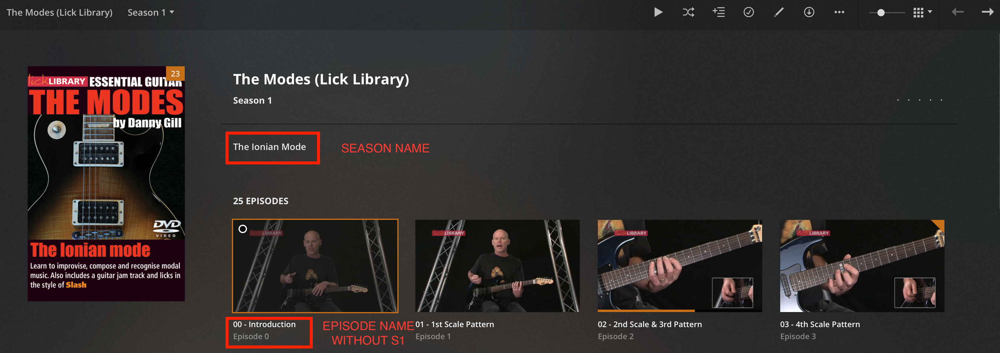
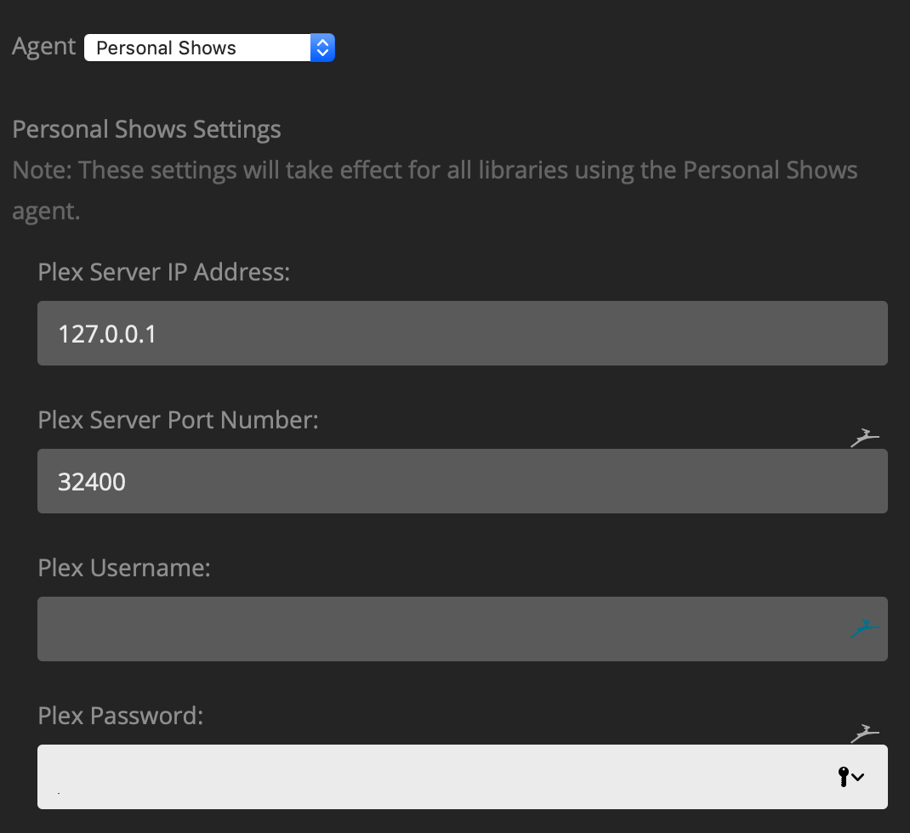
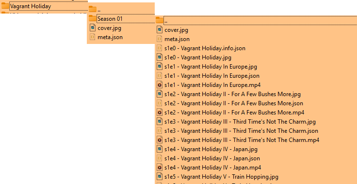

# Personal Shows Metadata Agent For Plex

2025: This repo is RESSURECTED!!! **Episode titles now work properly!!!!!!!** 

Now works with current version of plex on October 14th 2025.

Todo:
- [ ] Fix and publish my youtube playlist downloader. This downloads a playlist, and automatically generates metadata and structures the output for this scanner.

This agent helps manage personal shows like tutorials, home videos which are not available on TVDB or any other online metadata sources.

## Final Output

1. All your Personal Shows will be displayed as TV shows with seasons and episodes. 
1. The season will have its title stored as `summary`. 
1. Episodes will derive their names from the file names excluding the `S1E1` part to make them cleaner.
1. Each Show can have its custom poster.
1. Each Season can have its custom poster.
1. Each Episode can have its custom thumbnail.
1. You can also add a set of values for fields much like other media




## Installation

1. Download the latest release zip from the Releases Page.
1. Extract.
1. Delete the `docs` folder if you think the size is too big. It contains the images shown in this readme.
1. Rename the downloaded folder from `---.bundle-master` to `---.bundle`.
1. Place it in `~/Library/Application Support/Plex Media Server/Plug-Ins` directory.


## Configuration

Choose `Personal Shows` agent in `Advanced` section of your library.

### Preferences

There is a bug in Plex where it does not update the database with season summary from the XML. So, to get around it, this agent updates the summary using the HTTP API. To do that, it needs to generate an API token. That is why, it requires the network information and the credentials to your plex. However, if you don't feel good about typing the credentials, you can simply leave all the fields empty and the agent will not update the season's summary with folder name.

Just note that the credentials never leave your network as long as your plex is on the local network. So its not any more unsafe than lets say adding your opensubtitles credentials. But, up to you!

**Make sure to put in the proper IP and Port**



### Naming

Name your shows in the following manner:

```
Media Library
--- Test Show # This is the show name
------ cover.jpg # default poster for the show
------ meta.json # Show level meta
------ Season 01 # This is the Season or group name, it can be renamed INSIDE plex (maybe later ill add feature to define its name inside the meta)
---------- cover.jpg # default poster for the season
---------- meta.json # Season level meta
---------- s1e1 - episode one.mp4 # Video file
---------- s1e1 - episode one.jpg # Thumbnail for episode
---------- s1e1 - episode one.json # meta data for the episode
---------- s1e2 - episode two.mp4
---------- s1e2 - episode two.jpg
---------- s1e2 - episode two.json
...
```

posters/covers are done with having the `jpg`|`jpeg`|`png`|`webp` of the exact same name.
ex: `S1E10 - 10 Paul And The New Testament.mp4`; poster: `S1E10 - 10 Paul And The New Testament.jpg`

I believe most of these are optional, I havnt tried it, but it works atleast if you have the meta, with empty params.



#### Just make sure that you DON'T pad the season and episode numbers for 0s. For example, use S1E1 instead of S01E01. Otherwise, the Episode names will contain S01E01 section in plex as well.

---

## Additional/Example Metadata

You can add additional metadata like posters etc. To do that, create a `meta.json` file in the root of your TV Show. For example, `Guitar Scales/meta.json`. Following keys are available


Here are all the possible fields accepted:


### Show level Json

```json
{
  "studio": "Homemade Studios",
  "summary": "This is a summery for the 'Show'",
  "originally_available_at": "2020-03-09",
  "genres": [],
  "collections": [],
  "actors": [
    {
      "name": "Jim Bob",
      "role": "That dude",
      "photo": "http url to profile picture"
    }
  ]
}
```

### Season Level Meta

```json
{
  "summary": "This season is about how episodes are a thing!",
}
```


### Episode Level Meta
```json
{
  "title": "Episode Title",
  "summary": "This is a description of the episode!",
  "originally_available_at": "2020-03-10",
  "rating": 7.3,
  "writers": [
    {
      "name": "Joe Blow",
      "photo": "http url to profile picture"
    }
  ],
  "directors": [
    {
      "name": "Smoe Doe",
      "photo": "http url to profile picture"
    }
  ]
}

```